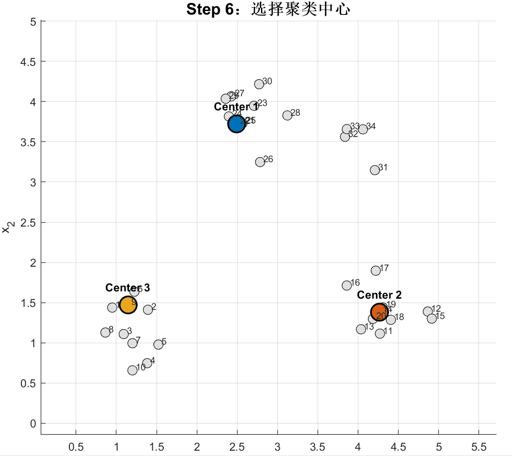

<h1 align="center">Density-Peaks-Clustering-Demo</h1>

<p align="center">
  <b>一个密度峰值聚类可视化 Demo，通过局部密度、相对距离、决策图、聚类中心选择和样本逐步分配，直观呈现 DPC 的完整执行过程。</b>
</p>

<p align="center">
  
  
  <a href="https://github.com/LiMingKuan-UESTC/Clustering-Matlab-Demo/stargazers">
    
  </a>
</p>

本项目主要面向算法入门、课堂展示和课程实验场景，希望通过交互式动画展示密度峰值聚类的关键步骤，帮助理解局部密度 `rho`、相对距离 `delta`、决策图以及样本归属过程，而不是一开始就堆叠复杂公式和理论说明。

## 效果展示



---

## 算法演示流程

本项目将密度峰值聚类过程划分为以下几个阶段：

1. 展示原始二维样本点；
2. 根据样本间距离确定截断距离 `dc`；
3. 使用 Gaussian kernel 计算局部密度 `rho`；
4. 计算每个样本到更高密度点的最近距离 `delta`；
5. 构造 `rho-delta` 决策图；
6. 根据 `gamma = rho × delta` 选择聚类中心；
7. 按照局部密度从高到低依次分配其余样本。

密度峰值聚类的基本思想是：聚类中心通常同时具有较高的局部密度，以及与其他更高密度点之间较大的距离。

## 参数设置

界面底部提供以下两个参数：

| 参数    | 默认值 | 说明                     |
| ----- | --: | ---------------------- |
| `K`   |   3 | 需要选择的聚类中心数量            |
| `dc%` | 2.0 | 用于确定截断距离 `dc` 的样本距离百分位 |

修改参数后，点击“重新计算”即可生成新的聚类结果并重新开始演示。

## 自检模式

本项目提供非 GUI 自检功能，可用于检查核心算法是否能够正常运行。

在 MATLAB 命令窗口中执行：

```matlab
demo('selftest')
```

自检内容包括：

* 距离矩阵尺寸是否正确；
* 距离矩阵对角线是否为零；
* 距离矩阵是否对称；
* `rho`、`delta` 和 `gamma` 的长度是否正确；
* 聚类中心数量是否符合设定；
* 所有样本是否被分配到有效类别；
* 样本分配顺序是否完整。

自检成功后，命令窗口会输出：

```text
demo_dpc selftest passed.
```

## 项目结构

```text
Density-Peaks-Clustering-Matlab-Demo
├── assets/
│   └── display.gif     # 项目运行效果演示
├── demo.m              # 主程序：交互式密度峰值聚类演示
├── README.md           # 项目说明文档
└── LICENSE             # 开源协议
```

---

## 默认示例数据

程序默认生成四组二维随机样本，并使用固定随机种子保证每次运行时的数据一致：

```matlab
rng(7);
```

默认设置为：

```matlab
K = 3;
dcPercent = 2.0;
```

可以直接修改 `demo.m` 中的样本矩阵 `X`，观察不同数据分布下的密度峰值聚类过程。

---

## 实现说明

本项目采用 Gaussian kernel 计算局部密度：

```matlab
rho = sum(exp(-(D ./ dc) .^ 2), 2) - 1;
```

对于每个非最高密度样本，`delta` 表示它到其他更高密度样本的最近距离。

程序进一步计算：

```matlab
gamma = rho .* delta;
```

并选择 `gamma` 最大的前 `K` 个样本作为聚类中心。

其余样本按照局部密度从高到低依次处理，并归属到最近高密度邻居所在的类别。

---

## 后续计划

* [ ] 补充更多不同分布的二维测试数据
* [ ] 支持用户从文件中导入自定义样本
* [ ] 支持在图中交互式添加和删除样本点
* [ ] 增加 Cut-off kernel 与 Gaussian kernel 的切换
* [ ] 增加聚类中心手动选择模式
* [ ] 增加最终聚类结果与真实标签的对比展示
* [ ] 拆分算法模块与 GUI 模块，方便单独调用
* [ ] 在功能稳定后发布第一个版本标签，例如 `v0.1.0`

## License

本项目基于 Apache-2.0 License 开源。

欢迎 Star ⭐ 和 Fork！

## 相关项目

* [K-Means-Clustering-Demo](https://github.com/LiMingKuan-UESTC/K-Means-Clustering-Demo)
* [Clustering Matlab Demo](https://github.com/LiMingKuan-UESTC/Clustering-Matlab-Demo)
